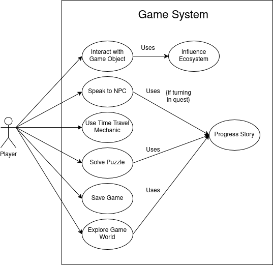
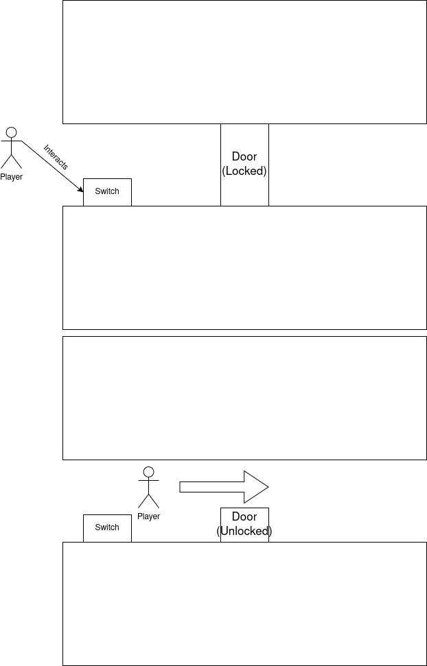
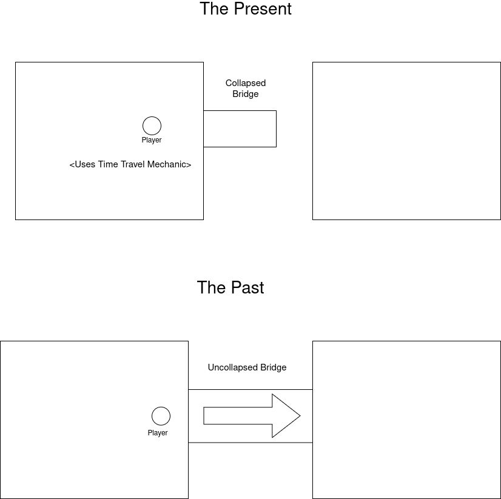
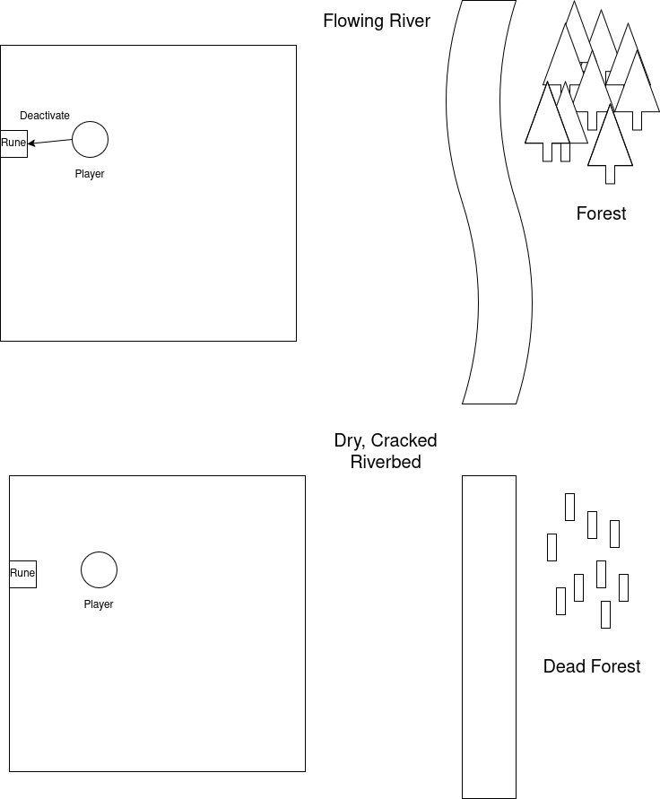
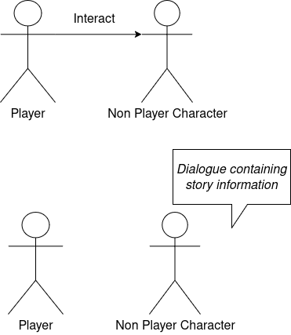

### 1\. Positioning

#### **Problem statement**

The problem of dissatisfaction with the stress and tedium of everyday life affects people who enjoy exploring other worlds and solving novel puzzles, the impact of which is people suffering boredom when they lack a meaningful avenue of escapism.

#### **Product Position Statement**

For adventure gamers and people who enjoy a variety of games who attain fulfillment in life through vicariously experiencing virtual stories, The Echoes of Time is an adventure game that gives them a brief escape from reality into a new virtual world; unlike other adventure games, which avid adventure game consumers may have played before, our product is a story about time which they have yet to experience.

**Value Proposition:** Echoes of Time is an adventure game that helps gamers who like puzzles and storytelling relax and exercise their puzzle-solving skills, exploring themes of time and unforeseen consequences alongside modern issues like environmentalism.

**Customer Segment:** Gamers who enjoy adventure games and storytelling

### 2\. Stakeholders

**Users (Casual Gamers)** \- people who like adventure games and trying out new games. Want entertainment. Responsible for giving the game a chance/playing it.

**Software Developers** \- members of the dev team who have some experience coding, and want a product to turn in and show to prospective employers. Responsible for implementing the mechanics of the game on GoDot and ensuring that assets load smoothly.

**Art Team** \- members of the dev team who like/do art. Responsible for fleshing out the story of the game, developing art assets, and finding appropriate sound assets.

**Test Users** \- people who are willing to try out the game while it is being developed. Responsible for play-testing the game and giving honest feedback.

**Professor** \- Dr. Palmer, professor of the course. Responsible for equipping dev team with the skills needed to collaborate effectively and encouraging consistent progress with graded assignments. 

### 3\. Functional requirements (features)

1. Changing of locations/rooms in game

2. Saving changes in each location and updating other rooms

3. Interactivity with items and assets in each room 

4. Moveable player character in a 2D space

5. Player-viewable rooms

6. Complete, compelling story

7. Interesting visual art

8. Fitting music/soundtrack

### 4\. Non-functional requirements

1. Portable \- important because ….  
   1. Playable on Windows  
   2. Playable on Linux (Ubuntu/Linux Mint)  
2. 

### 5\. Minimum Viable Product

Online playable demo with a focus on interactive and shifting story. We are going to validate that the game has a story that grips the player’s attention, alongside having working environments that change based on player actions. We also want interactable environments that have consequences. 

### 6\. Use cases
#### Use Case Diagram

#### Use Case \#1:
##### Solve Puzzle
- Actor: Player
- Trigger: Player's encounters a locked door
- Preconditions: Player is in a puzzle scenario
- Postcondition: Player moves past door
##### Success Scenario:
- System displays a locked door
- Player interacts with puzzle elements
- System responds (e.g. gears turn)
- Player discovers solution
- Player implements solution
- System unlocks door
##### Interface Sketch

#### Use Case \#2:
##### Use Time Travel Mechanic
- Actor: Player
- Trigger: Player engages time altering mechanic
- Preconditions: Player has unlocked time altering
- Postconditions: Game state changes
##### Success Scenario:
- Player rewinds time to clear an obstruction
- Game loads "past" level screen
- Player clears said barrier
##### Alternate Scenario \#1:
- Player fast forwards time to clear an obstruction
- Game loads "present" level screen
- Player clears said barrier
##### Interface Sketch

#### Use Case \#3:
##### Influence Ecosystem
- Actor: Player
- Trigger: Player escapes dungeon
- Precondition: Player has solved puzzles required to exit
- Postconditon: Ecosystem is significantly altered
##### Success Scenario
- Player, to escape dungeon, deactivates rune
- Player is able to leave dungeon
- System updates environment (e.g. forest is dead)
##### Interface Sketch

#### Use Case \#4:
##### Progress Through Story
- Actor: Player
- Trigger: Player completes checkpoint puzzle
- Preconditions: Player has completed all previous checkpoints
- Postcondition: New Scene or dialogue is loaded
##### Success Scenario
- Player Solves a puzzle
- Game gives feedback (audio/visual)
- Player learns more about game world
##### Interface Sketch

### 7\. User stories

(1) As an adventure enthusiast, I want multiple possible endings so that I feel like I have agency in the story.  
	Priority: 7/10	&emsp;&emsp;  Hours Estimate: 20

(2) As a puzzle enjoyer, I want challenging puzzles so that I feel accomplished after playing.  
	Priority: 4/10	&emsp;&emsp;  Hours Estimate: 15

(3) As a casual gamer, I want simple, clear mechanics so that I can play without frustration.  
	Priority: 8/10	&emsp;&emsp;  Hours Estimate: 10

(4) As a cybersecurity nerd, I want open-source software so that I can personally confirm the privacy and security of the game.  
	Priority: 6/10	&emsp;&emsp;  Hours Estimate: 2

(5) As someone who likes art, I want stylistic graphics so that I can feel more immersed in the story.  
	Priority: 9/10	&emsp;&emsp;  Hours Estimate: 30

(6) As someone who enjoys games with engaging world building, I want a deep story that takes place in an interesting world so I feel immersed when playing.  
	Priority: 6/10	&emsp;&emsp;  Hours Estimate: 20

(7) As someone who is interested in video game design, I want interesting and unique mechanics that interact in novel ways so I am engaged by the game.  
	Priority: 3/10	&emsp;&emsp;  Hours Estimate: 30
 
(8) As a soundtrack enjoyer, I want an original soundtrack for the game so that it feels unique.  
	Priority: 2/10	&emsp;&emsp;  Hours Estimate: 15

### 8\. Issue Tracker

URL: https://github.com/NoomMiner/Echoes-of-Time/issues

