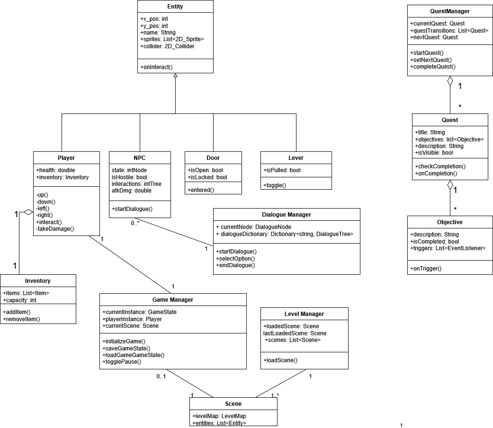

# System Description
The problem of dissatisfaction with the stress and tedium of everyday life affects people who enjoy exploring other worlds and solving novel puzzles, which causes boredom when people lack a meaningful avenue of escapism.
For gamers who enjoy experiencing virtual stories, the adventure game Echoes of Time provides a brief escape from reality into a new virtual world. Echoes of Time has value in its novelty, giving players the opportunity to experience its story for the first time--unlike other open-source adventure games, which many avid adventure gamers have already played before. Overall, this game helps gamers who like puzzles and storytelling relax and exercise their puzzle-solving skills, exploring themes of time and unforeseen consequences alongside modern issues like environmentalism.

Echoes of Time aims to entertain gamers who enjoy casual adventure games, puzzles, and fun storytelling. Our player base is only responsible for giving our game a chance. Our system must be consistent with this goal, providing simple and easy-to-understand mechanics, appealing art assets, and an environment for the players to explore and enjoy. Echoes of Time is set in a fictional world of dragons and monsters, a world where traveling across time exists and is accessible to the player. Interacting with this world is one of the highlights of this game, helping users immerse themselves in a virtual fantasy world and become invested in the lives of the fictional people and town within. We also hope to expand this experience through a musical soundtrack. 

We will incorporate various aspects of this world so as many people can enjoy it as possible. We will keep it portable, so any player can play the game at any point. We intend to maintain and update the game as it develops. We will design controls that remain smooth regardless of the device used to play. 

The **Entity** is the parent of **Player**, **NPC**, **Door**, and **Lever**. The **Player** is associated with one *Inventory* and **Game Manager**. **NPC** is connected to **Dialogue Manager**. **Game Manager** is connected to **Scene**. **Scene** is connected to **Level Manager**. 

# Model

