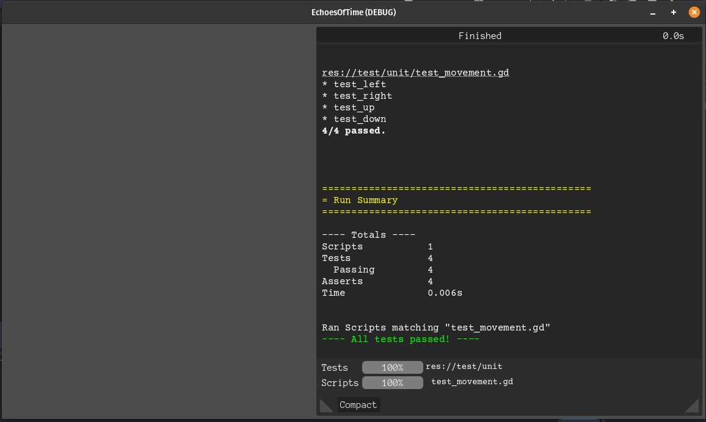

# Introduction

# Requirements
**Requirement**: As a casual gamer, I want simple, clear mechanics so that I can play without frustration. 
**Issue**: [Issue #12](https://github.com/NoomMiner/Echoes-of-Time/issues/12) 
**Pull request**: https://github.com/NoomMiner/Echoes-of-Time/pull/43 
**Implemented by**: Yahir 
**Approved by**: Tyler 

# Tests
The testing framework used was GUT (Godot Unit Testing). The test scripts can be viewed [Here](../EchoesofTimeGodot/test/unit).
## Example test
- Class Tested: [player.tscn](../EchoesofTimeGodot/player.tscn)
- Script: [test_movement.gd](../EchoesofTimeGodot/test/unit/test_movement.gd)  

This test ensured that the correct velocity was applied to the character depending on the direction pressed.

# Technology

# Deployment
- [Link to itch.io]()  
We have decided to deplot the product on the independent game development platform itch.io. We chose itch.io because it is a very popular platform for inde game developer who are looking to get a start. We will deploy by creating a page for the project on itch.io and uploading an executable.

# Licensing

# UX Design

# Lessons Learned

# Important Files
- [README](../README.md)
- [CONTRIBUTING](../CONTRIBUTING.md)
- [CODE OF CONDUCT](../CODE_OF_CONDUCT.md)

