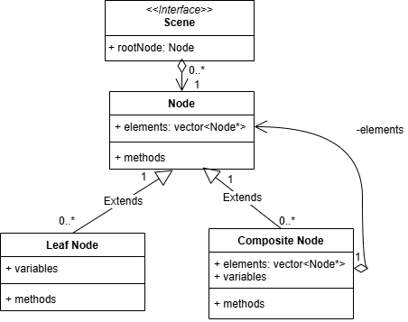

# Description
For gamers who enjoy experiencing virtual stories, the adventure game Echoes of Time provides a brief escape from reality into a new virtual world. Echoes of Time has value in its novelty, giving players the opportunity to experience its story for the first time--unlike other open-source adventure games, which many avid adventure gamers have already played before. The current system, which is implemented in GoDot with the graphical user interface and GDScript, includes a moveable player character in a top-down world implemented with tilesets, three interactive objects (a 'weird clock', a door, and a cake), two rooms that the player can move between, and a simple puzzle. With this we're using the stylistic assets developed by our artist, Wil.

# Architecture

# Class Diagrams

**Note**: Godot base classes are not included in the diagram for readability
# Sequence Diagrams

## Use case 1:
 **Use case: pick up clock**
 **Actor:** the player
 **Trigger:** the player walks over the item.
 **Pre-conditions:** the item is not already picked up.
 **Post-conditions:** the item is added to the inventory
 **Success Scenario:**
     1. The user walks over the sprite
     2. The user obtains the clock
 **Alternate Scenario:** N/A

## Use case 2:
 **Use case: unlock door**
 **Actor:** the player.
 **Trigger:** the player presses 'q'.
 **Pre-conditions:** the player is next to the door and has the key.
 **Post-conditions:** the quest is completed and the player moves to the next room.
 **Success Scenario:**
     1. The user walks over to the door
     2. A message is sent that the player can use the key by pressing 'q'.
     3. The user presses 'q'.
     4. The player receives a notice that the quest is complete.
     5. The player enters the next room.
 **Alternate Scenario:** N/A
     1. The user walks over to the door
     2. A message is sent that door is locked.
     3. The user presses 'q'.
     4. The door does nothing.

# Design Patterns
Our group is working in the GoDot user interface and with GDScript. GoDot is object-oriented by nature, with projects organized as a tree of nodes. However, GoDot and GDScript do not really support the typical manual implementations of object-oriented design patterns like those listed. We did try to find work-arounds, but ran into various problems: C++ can be integrated with GoDot, but only by very experienced GoDot developers; there is no way to directly use pointers and references; and in dividing code into multiple classes, we ended up running into conflicts with the in-built GoDot functions we were using. When we searched for solutions, we tended to get the answer that other methods should be used to achieve the same effect (as I understand it, it is the method, not the effect, that is expected in this assignment.)

This is to say: instead, we sketched the design patterns using a combination of C++ syntax and GoDot functions/pseudocode, explaining how they relate to our project and what’s going on behind the scenes.

## State Design Pattern

The files associated with this diagram are in the folder: https://github.com/NoomMiner/Echoes-of-Time/tree/main/deliverables/StateDesignPattern
Specifically, they include the class files Context.cpp, HasClock.cpp, HasKey.cpp, InitialState.cpp, State.cpp, the header file ClassDefinitions.h, and a README which explains how this fits into our project.

## Composite Design Pattern

The files associated with this diagram are in the folder: https://github.com/NoomMiner/Echoes-of-Time/tree/main/deliverables/CompositeDesignPattern
Specifically, they include the class files Node.cpp, Scene.cpp, and someNodeType.cpp, Node.h, and a README which explains how this relates to GoDot.

# Design Principles
### Single Responsibility Principle:
*In our game architecture, each class focuses on a single aspect of the game’s functionality.* 
#### 1\. The QuestManager only handles quest related operations using methods like startQuest(), setNextQuest() and completeQuest(), everything quest related is handled within the QuestManager class. 
#### 2\. The same goes for the DialogueManager class. Their sole purpose is to manage dialogue flow using methods like startDialogue(), selectOption(), and endDialogue() 
#### 3\. The SaveManager class focuses solely on saving/loading the game state using initializeGame(), saveGameState() and loadGameState().

### Open/Closed Principle:
*The design is structured to be extended without modification of existing code.* 
#### 1\. The Entity class serves as a base with onInteract() that subclasses Player, NPC, and Interactable extend without modifying the existing code.
#### 2\. Intractable interface enables extension through various interaction handlers like _on_area_2d_body_entered()  and _on_area_2d_body_exited()  
#### 3\. The Quest system is designed to be extended with new quest types without changing the QuestManager class.

### Liskov Substitution Principle: 
*The class hierarchy ensures derived classes can be used in place of their base classes.*
#### 1\. Both Player and NPC inherit from Entity and can be stored in the Scene's entities: List<Entity> collection
#### 2\. Different CollisionShape2D objects can be processed uniformly through the colliders collection in Scene
#### 3\. Various save states from Player, Inventory and quest systems can all be handled by the SaveManager

### Interface Segregation Principle:
*The diagram describes specialized interfaces focused on specific game functions.*
#### 1\. Separate HealthDisplay and QuestDisplay interfaces rather than a single monolithic UI interface
#### 2\. Interactable with specific interaction methods rather than implementing the full Entity interface
#### 3\. RichTextLabel used for specific purposes in both dialogue and quest displays rather than one generic text interface

### Dependency Inversion Principle:
*High level game modules depend on abstractions shown in the relationships between manager classes.*
#### 1\. MainNode depends on abstract managers such as LevelManager, PlayerHUD, and SaveManager rather than their implementations
#### 2\. PlayerHUD references display abstractions like HealthDisplay, InventoryDisplay, and QuestDisplay rather than concrete classes
#### 3\. Scene works with abstract Entity objects through its entities: List<Entity> rather than specific entity types
